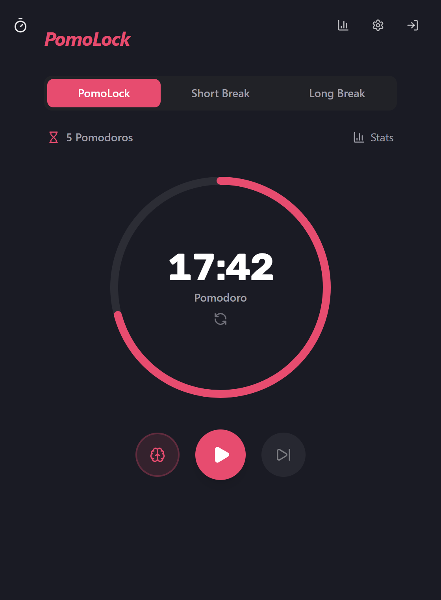
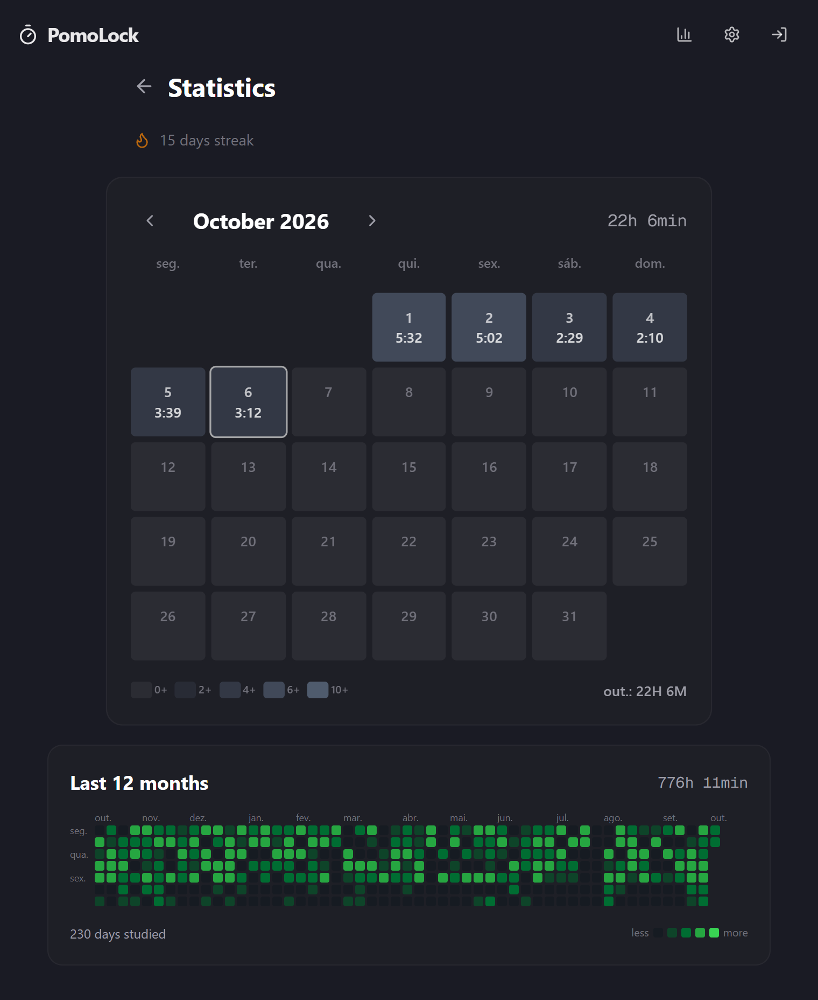

<div align="center">


# PomoLock

**A Pomodoro timer that respects your focus and shows your consistency.**

[**Open the app →**](https://pomolock.vercel.app)


<br />


&nbsp;&nbsp;


</div>

---

## The idea

I wanted a simple Pomodoro timer that showed my consistency like a habit tracker, in the style of
[YeolPumTa (열품타)](https://play.google.com/store/apps/details?id=com.pallo.passiontimerscoped), and that
worked the same on my home computer and at university. I could not find one, so I built it.

## What it does

### ⏱️ Timer
- Focus, short break and long break with configurable lengths, and a long break every N Pomodoros.
- Optional auto-start for breaks and Pomodoros.
- Keyboard shortcut: <kbd>Space</kbd> starts and pauses.
- Keeps accurate time with the tab in the background, after a reload or while the computer sleeps.

### 🧠 Hyperfocus
When a Pomodoro ends and you are on a roll, the timer does not interrupt you: extra time keeps counting until
you decide to take the break. If you forget the timer running, after **1h30 without interaction** it asks
whether you are still there and, with no answer, pauses on its own so it does not record hours you did not
study.

### 📊 Statistics
- A month calendar with the hours studied each day.
- A GitHub-style grid of the last 12 months.
- A streak of consecutive study days.

### ☁️ Sync
- Optional Google sign-in. Without it, everything is saved in the browser.
- Signed in, settings and sessions live in the cloud and show up on any device.
- Works offline and installs as an app (PWA). Time studied offline is uploaded when the connection returns.

### 🎨 Personalization
Colors for each mode, alarm sound and volume, time in the tab title and data export as JSON.

## How time is counted

Accurate statistics are the core of the app, so these are the rules:

| Situation | What is recorded |
|---|---|
| Finished Pomodoro | The full length |
| Skip, reset or mode switch midway | The time studied so far, if it is 1 minute or more |
| Pomodoro + hyperfocus | Both parts added together |
| Pauses | Nothing: paused time does not count |
| Forgotten hyperfocus | Only the time until the inactivity warning |
| Short and long breaks | Not counted as study |

The technical details are in [`docs/timer-clock.md`](./docs/timer-clock.md).

## Tech stack

| | |
|---|---|
| **Framework** | Next.js 16 (App Router) and React 19 |
| **Language** | TypeScript |
| **UI** | Tailwind CSS 4, shadcn/ui and Lucide |
| **State** | Zustand, saved to localStorage |
| **Backend** | Supabase: Google sign-in and PostgreSQL with Row Level Security |
| **Tests** | Vitest and Testing Library |
| **Deployment** | Vercel |

## Running locally

You need Node.js 20+, pnpm and a [Supabase](https://supabase.com) project (the free plan is enough).

```bash
git clone https://github.com/tiagoluterbach/pomolock.git
cd pomolock
pnpm install
cp .env.example .env.local
pnpm dev
```

Then set up Supabase:

1. Copy the project **URL** and **anon key** (Settings → API) into `.env.local`.
2. Run [`supabase/migration.sql`](./supabase/migration.sql) in the SQL Editor to create the tables.
3. Enable Google under Authentication → Providers, with OAuth credentials from Google Cloud.

The app opens at `http://localhost:3000`.

<details>
<summary><b>Other commands</b></summary>

| Command | What it does |
|---|---|
| `pnpm build` | Production build |
| `pnpm lint` | ESLint |
| `pnpm test` | Tests in watch mode |
| `pnpm test:run` | Runs the tests once |

</details>

<details>
<summary><b>Project structure</b></summary>

```
src/
├── app/           pages: timer, statistics, settings and login
├── components/    timer, statistics, settings and UI components
├── hooks/         user, timer and sessions
├── lib/           sync, statistics, export and utilities
├── stores/        global timer state
└── types/         types and default settings
supabase/          tables and access policies
public/            icons, sounds, service worker and timer worker
docs/              technical notes
```

</details>

## About

Built by **Tiago Luterbach**, a Computer Science student at UFF, with AI as a pair programmer for architecture,
implementation and code review.

Personal and educational use. Feel free to take inspiration from it.

<sub>🇧🇷 [Leia em português](./README.md)</sub>
